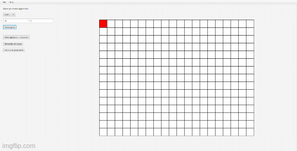

# MazeRunner

Desktop app to demonstrate maze generation algorithms and pathfinding algorithms.

### How to run

1. Clone project
<pre>git clone https://github.com/IAmFunkyFrog/MazeRunner.git</pre>
2. Use gradle to run application
<pre>./MazeRunner/gradlew run</pre>

### Implemented features
* Different types of labyrinth display:
  * Grid type
  * Graph type
* Algorithms for generating mazes
  * Euler algorithm
* Algorithms for finding path inside maze
  * Random algorithm
  * BFS
* Saving (loading) labyrinth in (from) file